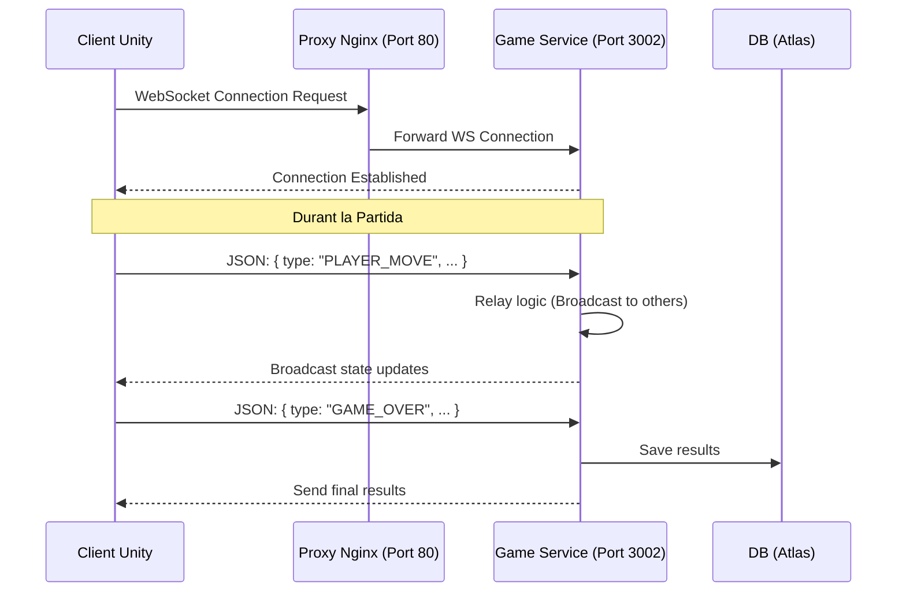
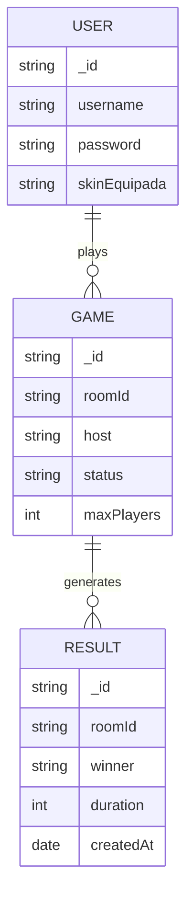
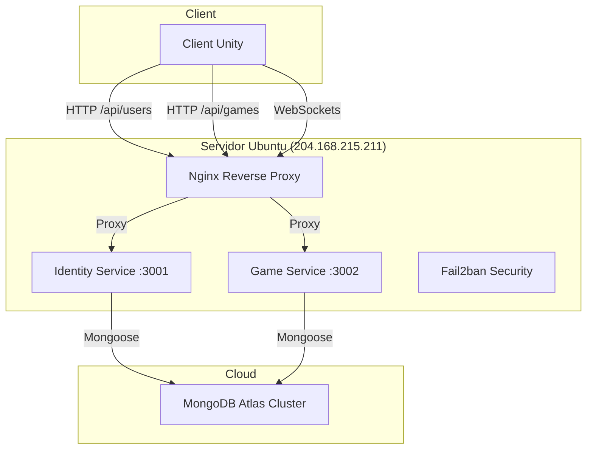

# Diagrames del Projecte TR3

## Diagrama de Casos d'Ús
```mermaid
useCaseDiagram
    actor Jugador
    
    Jugador -- (Identificació/Login)
    Jugador -- (Gestionar Inventari/Skins)
    Jugador -- (Crear Partida)
    Jugador -- (Unir-se a Partida existent)
    Jugador -- (Jugar Partida Multijugador)
    Jugador -- (Veure Resultats Finals)
```

## Diagrama de Seqüència (Sincronització de Partida)


## Diagrama Entitat-Relació (Base de Dades)


## Diagrama de Microserveis / Arquitectura

